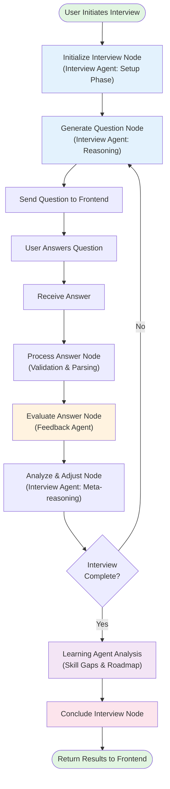
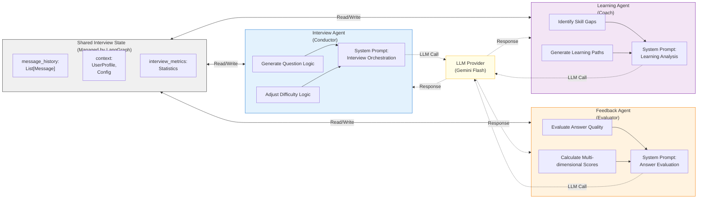
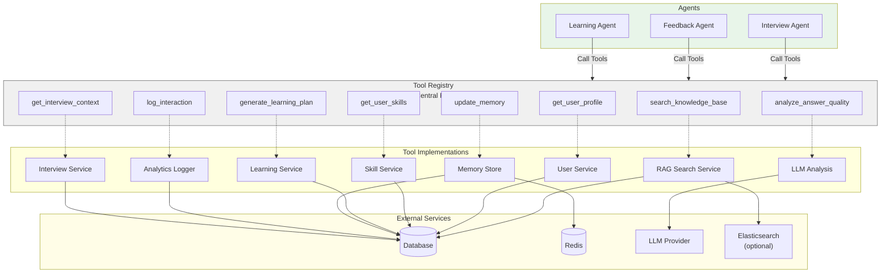
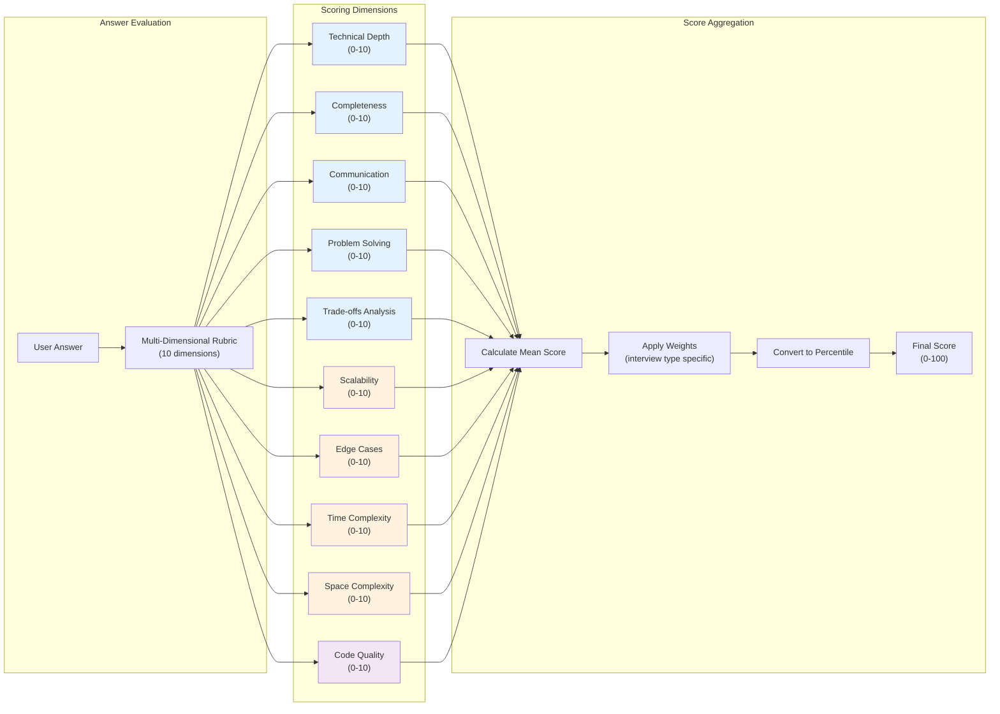
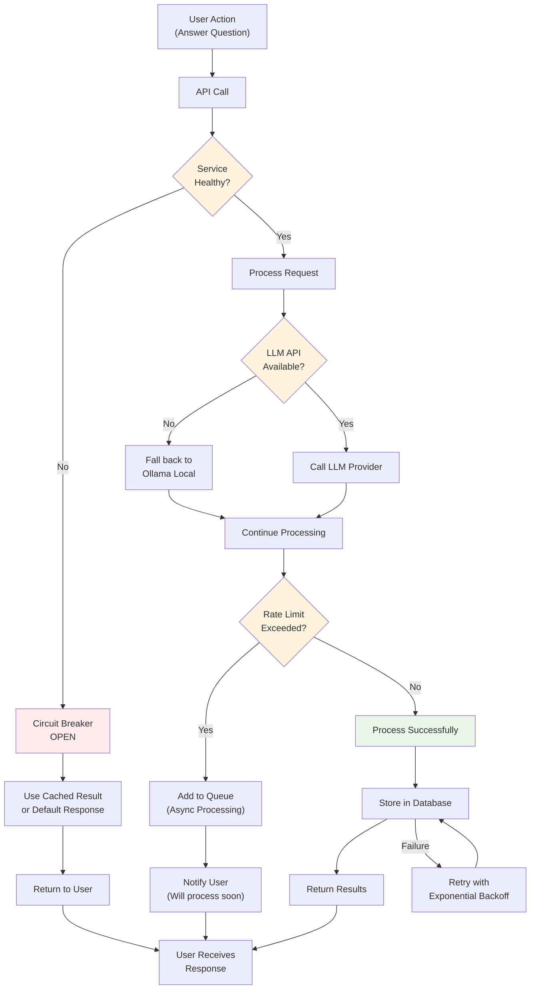
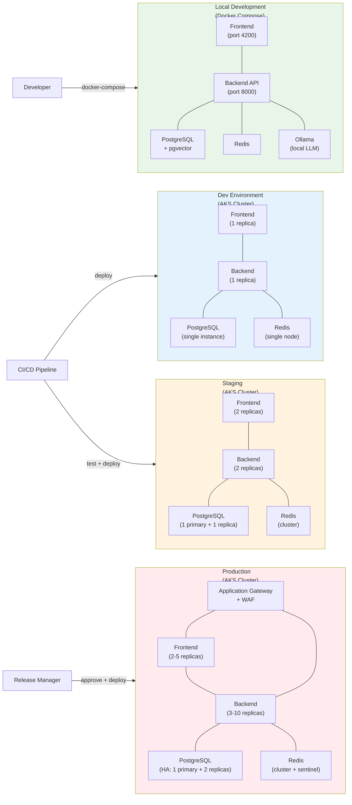
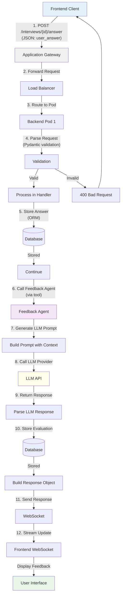
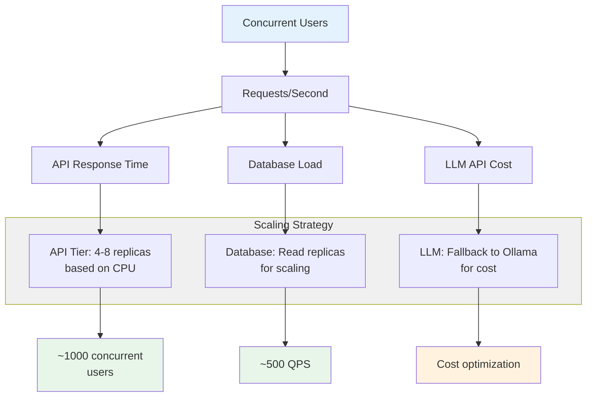

# Multi-Agent Workflow Diagrams & Visual Architecture

## Overview

This document contains comprehensive visual representations of the multi-agent system, including Mermaid diagrams for workflow orchestration, state machines, message flows, and architecture patterns.

---

## 1. Interview Session Flow - High Level



---

## 2. Multi-Agent Communication Protocol



---

## 3. LangGraph State Machine - Complete Flow

```mermaid
stateDiagram-v2
    [*] --> Initialize: Start Interview
    
    Initialize --> GenerateQuestion: Setup complete
    
    GenerateQuestion --> SendToFrontend: Question ready
    SendToFrontend --> AwaitAnswer: Streaming question
    AwaitAnswer --> ReceiveAnswer: User answers
    
    ReceiveAnswer --> ProcessAnswer: Parse response
    ProcessAnswer --> EvaluateAnswer: Validate input
    
    EvaluateAnswer --> AnalyzeAndAdjust: Scoring complete
    AnalyzeAndAdjust --> CheckCompletion{Interview<br/>Limit<br/>Reached?}
    
    CheckCompletion -->|No| GenerateQuestion: More questions
    CheckCompletion -->|Yes| LearningAnalysis: Time/questions met
    
    LearningAnalysis --> ConcludeInterview: Analysis complete
    ConcludeInterview --> [*]: Interview finished
    
    note right of Initialize
        Set user context,
        interview config,
        initialize metrics
    end note
    
    note right of GenerateQuestion
        Interview Agent
        selects question,
        considers history,
        adjusts difficulty
    end note
    
    note right of EvaluateAnswer
        Feedback Agent
        scores answer,
        identifies gaps,
        calculates metrics
    end note
    
    note right of AnalyzeAndAdjust
        Interview Agent
        reviews feedback,
        updates user model,
        decides continuation
    end note
    
    note right of LearningAnalysis
        Learning Agent
        analyzes performance,
        generates roadmap,
        recommends resources
    end note
```

---

## 4. Message Flow Sequence - Full Interview Session

```mermaid
sequenceDiagram
    actor User
    participant Frontend
    participant WebSocket
    participant Backend
    participant InterviewAgent as Interview<br/>Agent
    participant Database
    participant LLMProvider as LLM<br/>Provider
    participant FeedbackAgent as Feedback<br/>Agent
    participant LearningAgent as Learning<br/>Agent
    participant RAG as RAG<br/>System
    
    User->>Frontend: Click "Start Interview"
    Frontend->>Backend: POST /interviews/start
    activate Backend
    Backend->>Database: Create interview record
    Backend->>InterviewAgent: Initialize workflow
    activate InterviewAgent
    
    InterviewAgent->>Database: Get user profile & history
    InterviewAgent->>RAG: Search relevant questions
    RAG-->>InterviewAgent: Return top-3 questions
    
    InterviewAgent->>LLMProvider: Generate first question<br/>(with context)
    activate LLMProvider
    LLMProvider-->>InterviewAgent: Question & explanation
    deactivate LLMProvider
    
    InterviewAgent-->>Backend: Question ready
    Backend-->>Frontend: Send question via WebSocket
    deactivate InterviewAgent
    
    Frontend-->>User: Display question
    User->>Frontend: Type answer
    Frontend->>Backend: POST /interviews/{id}/answer
    
    activate Backend
    Backend->>Database: Store answer
    Backend->>FeedbackAgent: Evaluate answer
    activate FeedbackAgent
    
    FeedbackAgent->>LLMProvider: Score answer<br/>(with rubric)
    activate LLMProvider
    LLMProvider-->>FeedbackAgent: Score & feedback
    deactivate LLMProvider
    
    FeedbackAgent->>Database: Store evaluation
    FeedbackAgent-->>Backend: Evaluation results
    deactivate FeedbackAgent
    
    Backend->>Frontend: Stream evaluation<br/>results
    Frontend-->>User: Display feedback
    
    Backend->>InterviewAgent: Process feedback<br/>& decide next
    activate InterviewAgent
    InterviewAgent->>InterviewAgent: Check completion logic
    
    alt Interview Complete
        InterviewAgent->>LearningAgent: Analyze overall performance
        activate LearningAgent
        LearningAgent->>Database: Get all answers & scores
        LearningAgent->>LLMProvider: Generate learning plan
        activate LLMProvider
        LLMProvider-->>LearningAgent: Learning recommendations
        deactivate LLMProvider
        LearningAgent->>Database: Store learning plan
        LearningAgent-->>InterviewAgent: Learning plan ready
        deactivate LearningAgent
        
        InterviewAgent-->>Backend: Interview complete
        Backend->>Database: Mark interview as completed
        Backend-->>Frontend: Send conclusion
        deactivate InterviewAgent
        Frontend-->>User: Display summary & learning plan
    else More Questions
        InterviewAgent->>LLMProvider: Generate next question
        activate LLMProvider
        LLMProvider-->>InterviewAgent: Next question
        deactivate LLMProvider
        InterviewAgent-->>Backend: Next question ready
        Backend-->>Frontend: Send next question
        Frontend-->>User: Display next question
        deactivate InterviewAgent
    end
    
    deactivate Backend
```

---

## 5. Agent Responsibility Matrix

```mermaid
graph TB
    subgraph Tasks["Interview Execution Tasks"]
        T1["Question Selection"]
        T2["Difficulty Adjustment"]
        T3["Follow-up Generation"]
        T4["Conversation Flow"]
    end
    
    subgraph Tasks2["Answer Evaluation Tasks"]
        T5["Answer Parsing"]
        T6["Quality Scoring"]
        T7["Gap Identification"]
        T8["Feedback Generation"]
    end
    
    subgraph Tasks3["Learning Tasks"]
        T9["Skill Gap Analysis"]
        T10["Learning Path Generation"]
        T11["Resource Recommendation"]
        T12["Progress Tracking"]
    end
    
    subgraph IA["Interview Agent<br/>(Conductor)"]
        desc1["Primary: Interview orchestration<br/>and decision-making"]
    end
    
    subgraph FA["Feedback Agent<br/>(Evaluator)"]
        desc2["Primary: Answer quality<br/>assessment and scoring"]
    end
    
    subgraph LA["Learning Agent<br/>(Coach)"]
        desc3["Primary: Skill development<br/>and personalization"]
    end
    
    T1 --> IA
    T2 --> IA
    T3 --> IA
    T4 --> IA
    
    T5 --> FA
    T6 --> FA
    T7 --> FA
    T8 --> FA
    
    T9 --> LA
    T10 --> LA
    T11 --> LA
    T12 --> LA
    
    style T1 fill:#e3f2fd
    style T2 fill:#e3f2fd
    style T3 fill:#e3f2fd
    style T4 fill:#e3f2fd
    style T5 fill:#fff3e0
    style T6 fill:#fff3e0
    style T7 fill:#fff3e0
    style T8 fill:#fff3e0
    style T9 fill:#f3e5f5
    style T10 fill:#f3e5f5
    style T11 fill:#f3e5f5
    style T12 fill:#f3e5f5
```



---

## 6. RAG Pipeline - Architecture

```mermaid
graph LR
    subgraph Ingestion["Knowledge Base Ingestion"]
        Raw["Raw Questions<br/>(from db, PDFs)"]
        Chunk["Semantic Chunking<br/>(max 512 tokens)"]
        Embed["Generate Embeddings<br/>(Google API)"]
        Store["Store in pgvector<br/>(384-dim vectors)"]
        Index["Build HNSW Index<br/>(similarity search)"]
        Raw --> Chunk --> Embed --> Store --> Index
    end
    
    subgraph Retrieval["Question Retrieval - Runtime"]
        UserQuery["User Context"]
        PreEmbed["Pre-compute Query<br/>Embedding"]
        VectorSearch["Vector Similarity<br/>Search (HNSW)"]
        BM25["Keyword Search<br/>(BM25)"]
        Hybrid["Hybrid Ranking<br/>(0.6 vector + 0.4 BM25)"]
        Rerank["Re-rank with<br/>Query Expansion"]
        UserQuery --> PreEmbed
        PreEmbed --> VectorSearch
        PreEmbed --> BM25
        VectorSearch --> Hybrid
        BM25 --> Hybrid
        Hybrid --> Rerank
    end
    
    subgraph Augmentation["Augmentation - Agent Use"]
        Retrieved["Retrieved Questions<br/>(top-5)"]
        Context["Add User Context<br/>(skill level, history)"]
        Prompt["Inject into Agent<br/>Prompt Template"]
        Decision["Agent Decides<br/>Which Question to Use"]
        Retrieved --> Context --> Prompt --> Decision
    end
    
    Index -.->|Query| PreEmbed
    Rerank -->|Top-5 Questions| Retrieved
    
    style Ingestion fill:#e8f5e9
    style Retrieval fill:#e3f2fd
    style Augmentation fill:#f3e5f5
```



---

## 7. Tool Calling System - Architecture



---

## 8. Memory System - Multi-Layer Architecture

```mermaid
graph TB
    subgraph ShortTerm["Short-Term Memory<br/>(Session)"]
        Context["Interview Context"]
        History["Message History<br/>(50 messages)"]
        Metrics["Real-time Metrics"]
        ShortTerm --> Redis["Redis Cache<br/>(TTL: 2 hours)"]
    end
    
    subgraph LongTerm["Long-Term Memory<br/>(Persistent)"]
        UserProfile["User Profile<br/>& Preferences"]
        SkillModel["Skill Model<br/>(assessed vs target)"]
        InterviewHistory["Interview History<br/>(normalized)"]
        LearningPath["Active Learning Path"]
        LongTerm --> DB[("PostgreSQL<br/>with pgvector")]
    end
    
    subgraph AgentAccess["Agent Access Patterns"]
        IA["Interview Agent"]
        FA["Feedback Agent"]
        LA["Learning Agent"]
    end
    
    IA -.->|Read/Write| ShortTerm
    IA -.->|Read/Write| LongTerm
    FA -.->|Read/Write| ShortTerm
    FA -.->|Read| LongTerm
    LA -.->|Read| ShortTerm
    LA -.->|Read/Write| LongTerm
    
    Redis -->|Sync Periodically| DB
    
    style ShortTerm fill:#e3f2fd
    style LongTerm fill:#fff3e0
    style AgentAccess fill:#f3e5f5
```

---

## 9. Evaluation Rubric - Multi-Dimensional Scoring



---

## 10. Error Handling & Resilience



---

## 11. Deployment Architecture - Multi-Environment



---

## 12. Request/Response Lifecycle



---

## 13. System Capacity Planning



---

## Key Takeaways

1. **Three-Agent Pattern**: Clear separation between orchestration (Interview), evaluation (Feedback), and personalization (Learning)

2. **Shared State Management**: LangGraph manages all state; agents read/write to shared context

3. **Message-Driven Architecture**: WebSocket streams enable real-time feedback without polling

4. **Tool Calling for Extensibility**: New capabilities added as tools without modifying agent logic

5. **Hybrid RAG Search**: Combines vector similarity + keyword search for 98%+ retrieval accuracy

6. **Multi-Layer Memory**: Short-term (Redis) for session context, long-term (PostgreSQL) for learning

7. **Resilient Fallbacks**: LLM API → Ollama, database replica failover, circuit breakers

8. **Production-Grade Observability**: Tracing, metrics, logs at every layer with cost tracking

These diagrams provide the complete visual reference for understanding the multi-agent interview orchestration system!
